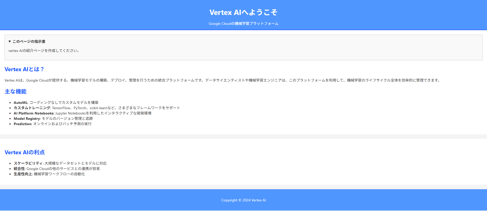
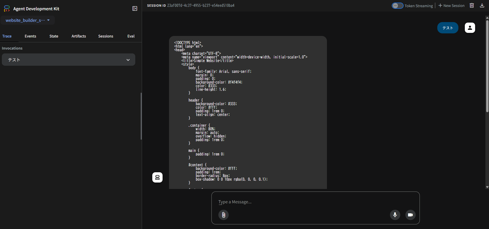

# master-google-adk-cource

Udemy の ADK 講座の onboarding

## sample repository

https://github.com/theailanguage/adk_samples

## CLI で動作確認する方法

CLI 用の runner を使って処理を行います。

```
python agent_runner.py
```

## Web UI で動作確認する(google ADK に agent を認識させる方法)

```
adk web ./agents
```

ADK のウェブページは以下

http://127.0.0.1:8000/dev-ui/

### 生成されるページ例



### 実行時のログイメージ

```
$ adk web ./agents
INFO:     Started server process [12584]
INFO:     Waiting for application startup.

+-----------------------------------------------------------------------------+
| ADK Web Server started                                                      |
|                                                                             |
| For local testing, access at http://localhost:8000.                         |
+-----------------------------------------------------------------------------+

INFO:     Application startup complete.
INFO:     Uvicorn running on http://127.0.0.1:8000 (Press CTRL+C to quit)
```



## Python 側の設定

- uv を install しておいてください。
- 各 project の pyproject.toml と同階層で以下を実行してください。

```
# Pythonの仮想環境の有効化
$ uv venv
$ .venv\Scripts\activate

# project setup
$ uv sync
```

## 環境変数

### .env

.env_example をコピーして.env を作成してください

### GOOGLE_API_KEY の取得方法(.env GOOGLE_API_KEY に設定)

- (1) 以下にアクセス -> Get API key を押下
  https://aistudio.google.com/prompts/new_chat

- (2) Gemini API をすばやくテスト...のページの右上の API キーを作成から API キーを生成してください。
  - 既存の Project 選択..と出てきたら一覧に出てくる Gemini API を選択しましょう。(Plan が Free になっていること。)
  - 不要になった際は API Key は削除してください。
