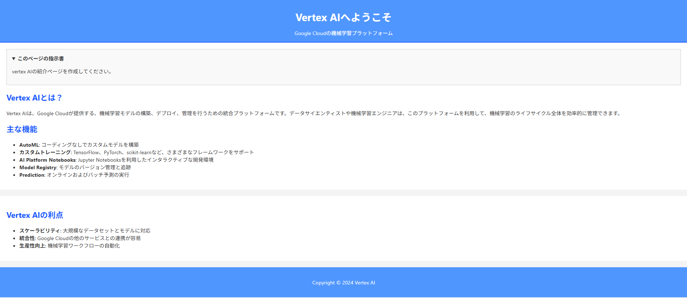
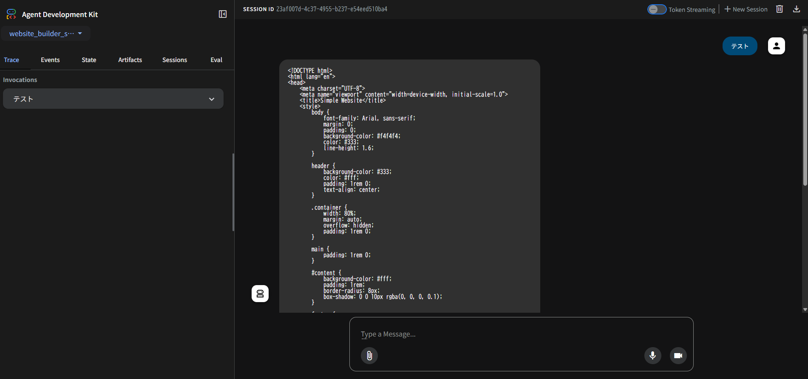

## App の実行(ADK の動作確認ページ)

pyproject.toml と同じ階層で以下

```
adk web ./agents
```

ADK のウェブページは以下

http://127.0.0.1:8000/dev-ui/

### 生成されるページ例



### 実行時のログイメージ

```
$ adk web ./agents
INFO:     Started server process [12584]
INFO:     Waiting for application startup.

+-----------------------------------------------------------------------------+
| ADK Web Server started                                                      |
|                                                                             |
| For local testing, access at http://localhost:8000.                         |
+-----------------------------------------------------------------------------+

INFO:     Application startup complete.
INFO:     Uvicorn running on http://127.0.0.1:8000 (Press CTRL+C to quit)
```


